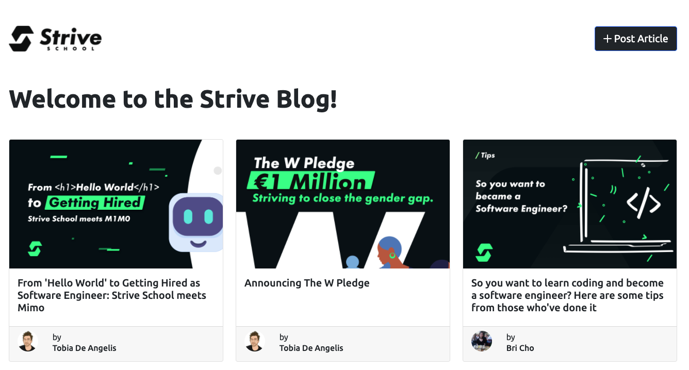

# Blog Front-end

Frontend React per un'applicazione blog moderna e responsive.

**Puoi vedere il sito live [Qui](https://6-node-express-mongo-db-ch-1-front-end.vercel.app/) 🌐**.

## 🖼️ Mockup



## 🚀 Caratteristiche

- Interfaccia utente moderna e reattiva
- Sistema completo di gestione articoli
  - Visualizzazione di tutti i post
  - Ricerca dei post per titolo
  - Filtro dei post per autore
  - Creazione di nuovi post con editor ricco
  - Modifica e eliminazione dei post esistenti
- Sistema di autori
  - Visualizzazione profilo autore
  - Lista dei post per autore
  - Avatar personalizzati
- Design completamente responsive
- Sistema di ricerca avanzato
  - Ricerca per titolo
  - Ricerca per autore
  - Risultati in tempo reale

## 🛠 Tecnologie

- React 18
- React Bootstrap
- React Router DOM
- Draft.js per l'editor di testo ricco
- React Icons

## 📦 Installazione

```bash
npm install
```

## ⚙️ Configurazione

Crea un file `.env` nella root del progetto:

```
REACT_APP_API_URL=http://localhost:8913
```

## 🚀 Avvio

```bash
npm start
```

L'applicazione sarà disponibile su http://localhost:3000

## 👤 Autore
Progetto creato da [Henry](https://github.com/henry8913) per scopi didattici.

## 📄 Licenza

Questo progetto è rilasciato sotto licenza MIT. Vedi il file LICENSE per i dettagli.
